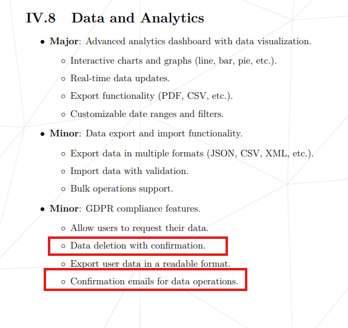

# Architecture questions

**Status:** Draft for team review
**Document owner:** rkravche, IT Architect
**Last updated:** July 26, 2026

Open decisions that must be agreed by the team before (or early in) implementation. Each question lists the options, the Architect's recommendation, who has the final say, and what work is blocked until it is decided. Agreed answers should be recorded as short ADRs in `docs/adr/`.

---

## Q1. Automate tutor eligibility from the 42 Intra API?

- **Context:** Instead of Head Tutors hand-maintaining who can evaluate what, the Intra `projects_users` data tells us which projects a user validated. Proposed model (architecture §13): **opt-in per tutor** — sync runs only for tutors who linked 42 OAuth *and* granted an `eligibility_sync` consent; everyone else stays manual; Head Tutor override always wins; sync never deletes.
- **To discuss:**
  1. Do we want the automation at all, or is manual-only acceptable for the product scope? 
   = the hitchhiker will login in and it will mark all the projects he consider able to evaluate and then the head tutor will confirm it
  2. Is per-tutor opt-in the right consent model (vs. automatic for all linked tutors)?
  3. Who creates and owns the 42 API application (keys live in `.env`, never in git)?
  4. Rate-limit budget: default app limits are ~2 req/s and 1200 req/h — enough for our campus size?
- **Recommendation:** it removes fragile manual admin work and strengthens the GDPR consent story at defense.

## Q1.1. Eligibility policy: what makes a tutor eligible?

"Completed the project" may not equal "should evaluate it." Intra gives us `validated?` and `final_mark`.
We could auto-grant on `validated?` OR auto-grant only above a mark threshold like N ≥ 100 or N ≥ 125 OR tutor suggests their projects and a Head Tutor approves each request.

## Q2. Poll anonymity

Current schema stores who voted for what — not anonymous.
Imagine somebody has an access to the database whether it's a developer or administarator and having promised that votes are anonymous a person who can leak data now sees your specific vote. This is the promise made in privacy-requirements we don't keep

## Q3. SMTP for GDPR confirmation emails

The GDPR minor module requires confirmation emails for data operations, but the MVP explicitly excludes email notifications. That still forces an SMTP relay (or dev mailcatcher) into the compose stack.

## Q4. Tailwind CSS or basic CSS

Has good support for dark mode mentioned in the `Demo/descirption.md`
