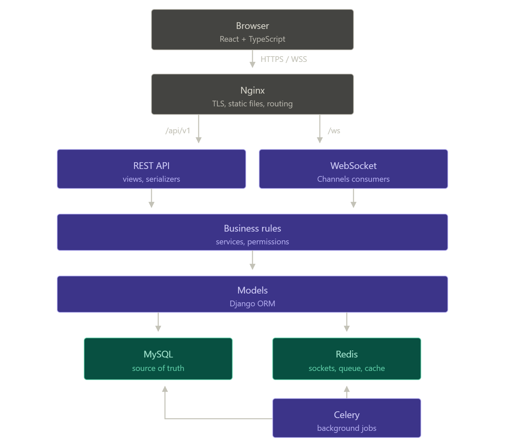

# Architecture

**Status:** Draft for team review
**Owner:** rkravche, IT Architect
**Last updated:** July 26, 2026

---

## 1. Purpose

This document defines the technical architecture of 42 Prague Evaluations.

---

## 2. Technology stack

| Layer | Technology| Pros |
| --- | --- |
| Frontend | React 18 + TypeScript, Vite |
| Styling | Tailwind CSS |
| Backend | Django 5 + Django REST Framework (DRF) + Django Channels | ORM, salted+hashed password auth, permission framework, i18n, admin panel. |
| Real-time | Django Channels | Real-time features major module. |
| Database | MySQL 8.4 (LTS), InnoDB | IT lead knows it better than anything else |
| ORM | Django ORM | Satisfies the ORM minor module with a technology built into the chosen framework. |
| Cache | Redis |
| Background jobs | Celery | A common choice for Python |
| Reverse proxy | Nginx |
| Deployment | Docker Compose |

---

## 3. Repository structure (monorepo)

```txt
/frontend        React + TS app (Vite)
/backend         Django project
  /apps/accounts       users, roles, auth, 42 OAuth, GDPR
  /apps/evaluations    projects, requests, slots, claims, lifecycle
  /apps/notifications  notification center + WS fan-out
  /apps/council        announcements, polls, SC inbox
  /apps/files          upload, validation, protected delivery
/infra           docker-compose.yml, nginx, prometheus, grafana
/docs            this documentation
Makefile         make up = the single deployment command
.env.example
```

---

## 4. Architecture diagram




---

## 4. Authentication

1. **Email + password (mandatory baseline).** Django's auth with Argon2 hasher (salted, memory-hard).
2. **42 OAuth 2.0 (minor module).** Authorization-code flow against the 42 Intra API. On first login we create/link the local account by intra login; users keep exactly one account (per `roles-and-permissions.md`).

---

## 5. Authorization

- Roles (Student, Tutor, Head Tutor, SC Member, Administrator) are rows in a `roles` table with a `user_roles` join.
- We do not simply hide buttons as it was stated but enforce the proper filtering on database level.

---

## 6. Environments and configuration

- All secrets and environment-specific values via environment variables; `.env` is git-ignored, `.env.example` committed (subject requirement).
- Self-signed TLS certificate generated at first `make up` for evaluation.
